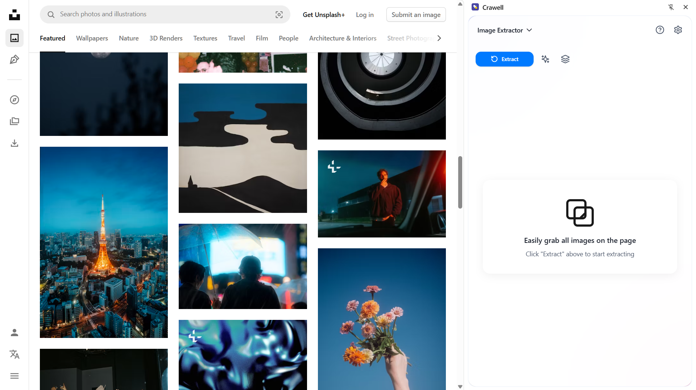
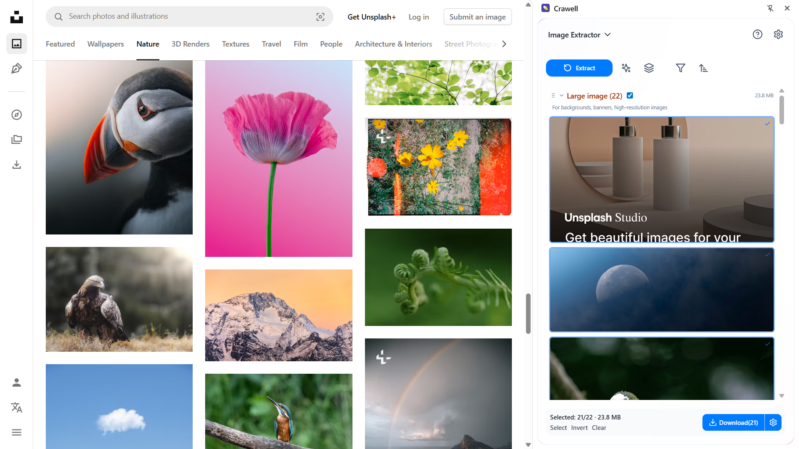

[中文](README_ZH.md) | English

# Crawell – One-Click Web Image & Content Extractor

> **Crawell** lets you instantly pull every image and article text from any webpage, batch-download them, convert to Markdown, and pack everything into a ZIP file. All processing is done locally in your browser—nothing is uploaded, your privacy stays private.

---

## ✨ Key Features
| Feature | Description |
| --- | --- |
| **Instant Image Extraction** | Automatically scans the page and groups results into ICON / THUMBNAIL / CONTENT / LARGE |
| **Markdown Conversion** | Detects heading levels, paragraphs, lists & keeps original layout |
| **Size & Format Filters** | Refine results by resolution, file size, or format |
| **Batch Download** | Download as a single ZIP or individual files, auto-renamed |
| **100 % Local Processing** | No login required, everything runs inside your browser |

---

## 📸 Screenshot Preview  

| Sidebar UI | Preview | Download |
| :--: | :--: | :--: |
|  |  |  |

---

## 🚀 Installation  
| Channel | Link |
| --- | --- |
| Chrome | <https://chromewebstore.google.com/detail/crawell/cmfcognoilmabnclomeehljmknallaaa> |
| Edge | <https://microsoftedge.microsoft.com/addons/detail/crawell/kakkpcohjjhikaedlghnnfinhpgkiihh> |
| Firefox | <https://addons.mozilla.org/en-US/firefox/addon/crawell> |

---

## 📝 How to Use
1. Open any webpage that contains images or text you want to grab.  
2. Click the **Crawell** icon in your browser toolbar—the sidebar opens automatically.  
3. Choose “Extract Images” or “Convert to Markdown”.  
4. **Preview → Filter → Select** the items you need.  
5. Click **Download** (ZIP or single files).

---

## 🔒 Privacy & Data Security
* **Zero server uploads** – all extraction and conversion is done locally.  
* **No personal data collection** – the extension never reads, stores, or transmits personally identifiable information.  
* **Account-free** – everything works out-of-the-box; you can optionally add an offline Ollama model.  

For more details, see [`PRIVACY.md`](PRIVACY.md).

---

## 💬 Feedback / Support
| Channel | Link |
| --- | --- |
| GitHub Issues | <https://github.com/kamjin3086/Crawell/issues> |
| Discord Community | <https://discord.gg/stDBJE8tva> |
| In-app Feedback | **Settings → Feedback** inside the extension |

