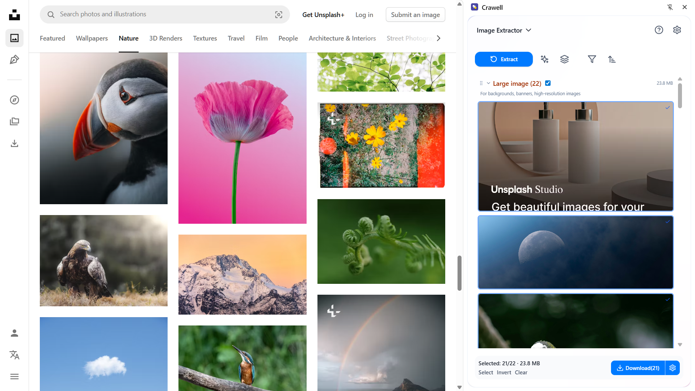

[English](README.md) | 中文

# Crawell – 网页图片 / 正文一键提取工具

> **Crawell** 帮你把网页中的图片与正文快速提取、批量下载，并支持 Markdown 转换、ZIP 打包等实用功能。所有处理均在本地浏览器完成，数据绝不上传服务器，隐私安全。

---

## ✨ 核心特性
| 功能 | 说明 |
| --- | --- |
| **图片一键提取** | 自动扫描并分类 ICON / THUMBNAIL / CONTENT / LARGE |
| **Markdown 转换** | 智能识别标题层级、段落、列表，保留排版样式 |
| **尺寸 & 格式过滤** | 依据分辨率 / 体积 / 格式多维筛选目标资源 |
| **批量下载** | 支持 ZIP 打包或单图下载，文件自动重命名 |
| **100% 本地运行** | 无需登录，所有操作在浏览器端完成，保护隐私 |

---

## 📸 截图预览

| 侧边栏界面 | 预览 | 下载 |
| :--: | :--: | :--: |
|  |  |  |

---

## 🚀 安装

| 浏览器 | 链接 |
| --- | --- |
| Chrome | <https://chromewebstore.google.com/detail/crawell/cmfcognoilmabnclomeehljmknallaaa> |
| Edge | <https://microsoftedge.microsoft.com/addons/detail/crawell/kakkpcohjjhikaedlghnnfinhpgkiihh> |
| Firefox | <https://addons.mozilla.org/en-US/firefox/addon/crawell> |

---

## 📝 使用步骤
1. 在包含素材的网页点击工具栏 **Crawell** 图标，侧边栏自动展开  
2. 选择「提取图片」或「转换 Markdown」  
3. **预览 → 过滤 → 勾选** 需要的资源  
4. 点击「下载」即可（支持 ZIP 或单文件）

---

## 🔒 隐私与数据安全
* **零服务器上传**：所有提取与转换操作在用户本地浏览器完成  
* **不收集个人数据**：扩展不会读取、存储或传输任何可识别个人身份的信息  
* **无需账户**：全部功能即装即用，亦可自行配置离线 Ollama 模型  
如需了解详细隐私政策，请参阅 [`PRIVACY.md`](PRIVACY_ZH.md)。

---

## 💬 反馈 / 支持
| 渠道 | 地址 |
| --- | --- |
| GitHub Issues | <https://github.com/kamjin3086/Crawell/issues> |
| Discord 社区 | <https://discord.gg/stDBJE8tva> |
| 扩展内反馈入口 | 安装后在 **设置 → 反馈** 提交 |

